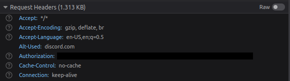

  
*Thanks to [Sour Dani](https://github.com/dangreene0) for the logo*
# Fast-Discord


 - [Download](#download)
 - [Origins of this project](#origins)
 - [Coding conventions](#coding-conventions)
 - [Build and Run](#build-and-run)
 - [Contact](#contact)
 - [Get your Discord token](#get-your-discord-token)
 - [License](#license)

This project is really huge and requires a lot of time so any help is welcome, from the smallest syntax correction to major changes.
## Download
You can get Fast-Discord in the artifacts of the latest workflow in the [Actions](https://github.com/EnyoYoen/Fast-Discord/actions) tab.
For Linux and MacOs, you need to install some dependencies :
- Debian / Ubuntu : 
```shell
$ sudo apt-get install qt5-default qtmultimedia5-dev libqt5networkauth5-dev libqt5svg5-dev libqt5websockets5-dev libpthread-stubs0-dev libopus-dev libsodium-dev
```
- MacOs (with [Homebrew](https://brew.sh/index)) : 
```shell
$ brew install qt5 libpthread-stubs libsodium opus
```  
Fast-Discord is available for Windows (x64), Linux (x64) and MacOs (x64) for now.  
You can compile Fast-Discord if it is not available for your operating system or your arch : [Build and Run](#build-and-run).
## Origins
The two main reasons that pushed me to create this project are: portability and client performance.
One day I wanted to install Discord on a Raspberry Pi, but I was running Ubuntu with an ARM processor, and Discord doesn't provide a version for computers running Linux and ARM processors.
And Discord is an application created with the Electron.js framework, so it uses a lot of resources, which is a shame for an application that you use in parallel with other applications most of the time.
## Coding Conventions
If you want to contribute to this project, you must respect the coding conventions from Qt (https://wiki.qt.io/Coding_Conventions).
## Build and Run
### Dependencies
- Qt5 (Widgets, Network, WebSockets, Multimedia)
- Pthread
- Opus
- Sodium

### Install the dependencies
**On Debian / Ubuntu :**
```shell
$ sudo apt-get install qt5-default qtmultimedia5-dev libqt5networkauth5-dev libqt5svg5-dev libqt5websockets5-dev libpthread-stubs0-dev libopus-dev libsodium-dev
```

**On Debian/Ubuntu arm64**
```shell
$ sudo apt-get install qtbase5-dev qtmultimedia5-dev libqt5networkauth5-dev libqt5svg5-dev libqt5websockets5-dev libpthread-stubs0-dev libopus-dev libsodium-dev
```

**On Windows (with [vcpkg](https://github.com/microsoft/vcpkg/#quick-start-windows)) :**
```shell
> vcpkg install qt5 qt5-websockets pthreads
```

**On MacOS (with [Homebrew](https://brew.sh/index)) :**
```shell
$ brew install qt5 libpthread-stubs libsodium opus
```

You will also need [CMake](https://cmake.org/download/) in your system PATH (Minimum version : 3.0)
### Build
In 'Fast-Discord/bin' folder :  
On Windows :
```shell
cmake .. -DCMAKE_TOOLCHAIN_FILE=(path/to/)vcpkg/scripts/buildsystems/vcpkg.cmake
cmake --build . --config Release
```
Otherwise :
```shell
cmake .. 
cmake --build .
```
### Run
The executable is in the 'Fast-Discord/bin' folder ;)
## Contact
Fast-Discord's discord server : https://discord.gg/DezBvjrGve
## Get your Discord token
Go to https://discord.com/login without logging in  
Press Ctrl+Shift+I to open the Web Developer Tools  
Go to the Network tab  

Press XHR  

Now log in : network requests should appear  

Open one of the request and search for the Authorization header in Request Headers (If it is not here, open an other request)  

Copy the token next to "Authorization"
## License
[MIT License](https://en.wikipedia.org/wiki/MIT_License)

Copyright (c) 2021 EnyoYoen

Permission is hereby granted, free of charge, to any person obtaining a copy
of this software and associated documentation files (the "Software"), to deal
in the Software without restriction, including without limitation the rights
to use, copy, modify, merge, publish, distribute, sublicense, and/or sell
copies of the Software, and to permit persons to whom the Software is
furnished to do so, subject to the following conditions:

The above copyright notice and this permission notice shall be included in all
copies or substantial portions of the Software.

THE SOFTWARE IS PROVIDED "AS IS", WITHOUT WARRANTY OF ANY KIND, EXPRESS OR
IMPLIED, INCLUDING BUT NOT LIMITED TO THE WARRANTIES OF MERCHANTABILITY,
FITNESS FOR A PARTICULAR PURPOSE AND NONINFRINGEMENT. IN NO EVENT SHALL THE
AUTHORS OR COPYRIGHT HOLDERS BE LIABLE FOR ANY CLAIM, DAMAGES OR OTHER
LIABILITY, WHETHER IN AN ACTION OF CONTRACT, TORT OR OTHERWISE, ARISING FROM,
OUT OF OR IN CONNECTION WITH THE SOFTWARE OR THE USE OR OTHER DEALINGS IN THE
SOFTWARE.
